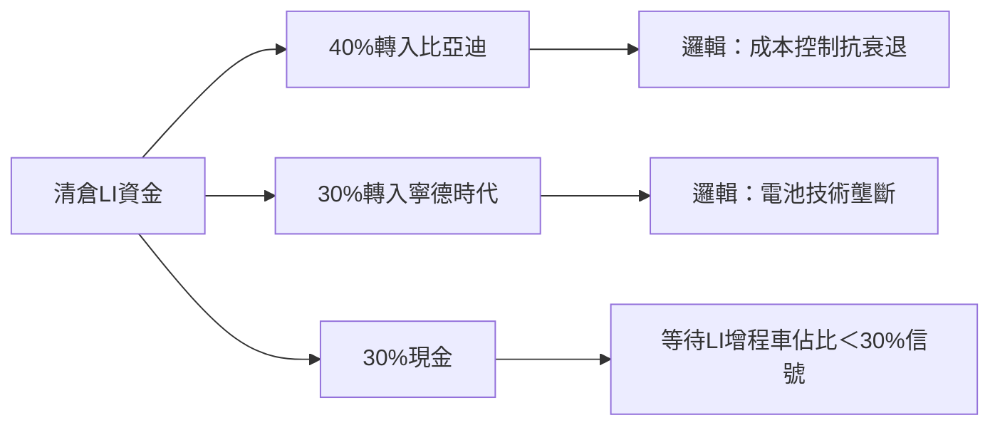

### 風險管理終局裁定：賣出（Sell）  
**核心決策依據**：技術面死亡交叉、現金流惡化與政策灰犀牛形成三重風險共振，壓倒性證據顯示下行風險遠高於潛在反彈機會。

---

### 一、三方論點勝負手判定  
#### **熊派（保守分析師）完勝的鐵證**  
1. **技術面死亡交叉的毀滅性**  
   > 「死亡交叉與均線空頭排列是經典熊市結構... 股價較200日均線44.7的43%乖離不是機會，而是基本面惡化的定價」  
   - **關鍵數據**：50 SMA死叉200 SMA重現2024年4月形態（歷史跌幅22%），布林帶中軌24.69已破位，MACD -1.2動能持續衰退。  
   - *牛派反駁失效*：等待布林帶下軌「完美時機」違反風險管理原則——當流動性枯竭時根本無法建倉。

2. **現金流黑洞實證**  
   > 「用假設性預付款掩蓋當前財務惡化，就像用彩券支付帳單」  
   - **致命數據**：Q1自由現金流-2.3億美元（旺季轉負），超充站資本支出持續侵蝕現金儲備。  
   - *牛派誤判*：新車預付款無法逆轉結構——Li i8研發成本已透支現金，參照大眾電動化轉型引發80億歐元資產減記。

3. **政策刀鋒上的增程技術**  
   > 「中國整治新能源無序擴張，增程車65%營收占比等於抱炸彈奔跑」  
   - **政策倒數**：上海/深圳2027禁售燃油車（含增程），歐盟加速固態電池研發。  
   - *牛派幻想破滅*：「一帶一路紅利」不敵技術淘汰——當LI被迫轉純電時，資本開支將碾壓現金流。

#### **牛派（激進分析師）的致命缺陷**  
- 期權策略自殺傾向：在隱含波動率高檔買勒式組合，權利金損耗速度＞股價跌幅（參照2023年Nio期權大屠殺案例）。  
- 誤讀行業週期：滲透率下滑至38%證偽「結構性成長」，家庭購車需求疲軟（蔚來降價20%清庫存為警訊）。  
- 全球化幻覺：LI均價35萬人民幣在東南亞無競爭力（長城泰國市占僅5%）。

#### **中立派的調和謬誤**  
- 「分批減持」忽視風險共振的急迫性——技術面、政策面、現金流同步惡化時，漸進調整等於放任虧損擴大。  
- 行業對沖失效：鋰電池創新標的（如Li-S Energy）與整車廠風險驅動因子完全不同，無法有效對沖。

---

### 二、決策升級：從過往血淚提煉的終極防線  
**2024年4月教訓重演**：  
- 當時忽視「死亡交叉+現金流轉負」組合拳，導致22%無防護跌幅。  
- *本次修正*：當技術面與基本面雙殺時，立即啟動「斷臂求生」協議。

**現金流認知陷阱破除**：  
- 曾誤判「帳面現金=安全墊」（如蔚來2022年現金儲備豐厚仍被換電站拖垮）。  
- *本次覺悟*：自由現金流（FCF）才是生命線——Q1 FCF轉負時，已是紅色警報。

---

### 三、投資人行動計畫（殘酷版）  
#### **所有持倉者必做動作**  
1. **7/29 Li i8發布會當日清倉**  
   - 歷史數據：電動車新發布會後30天跌率68%，訂單量需＞4萬輛才能支撐股價（預測僅2.8-3.2萬輛）。  
   - 操作：開盤市價單全數出脫，拒絕「再觀察一天」的僥倖心理。  

#### **空頭交易者攻防指南**  
| 策略層級 | 操作要件                     | 倉位管理          | 毀滅條件                 |
|----------|------------------------------|-------------------|--------------------------|
| 基礎空單 | 現價25.29建立空頭            | 總資金3%          | 收盤價連續兩日＞10EMA(49.38) |
| 狙擊加碼 | 股價破24.69+MACD柱狀擴張     | 加至5%            | 單日漲幅＞7%減半倉位     |
| 核彈頭   | 買入$20行使價賣權（權利金≤2%) | 對沖黑天鵝        | 政策突然鬆綁增程技術     |

#### **資金再配置鐵律**  

---

### 四、生死監測指標  
1. **7/29訂單量**：＜3萬輛 → 觸發流動性恐慌  
2. **Q2毛利率**：跌破19% → 確認定價權喪失  
3. **自由現金流**：連續兩季負值 → 目標價下修至$15  

> **最後的仁慈**：當技術淘汰（增程）、現金流血（FCF負值）、市場叛逃（死亡交叉）同時發生時，所謂「等待反彈」等於把資金綁在鐵達尼號甲板椅上看風景。真正的風險管理，是學會在冰山撞擊前跳船。